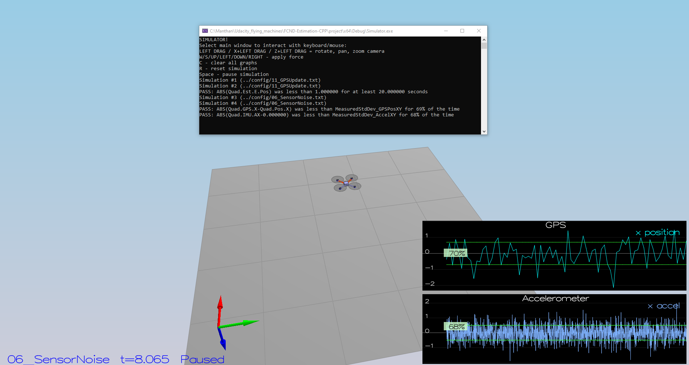
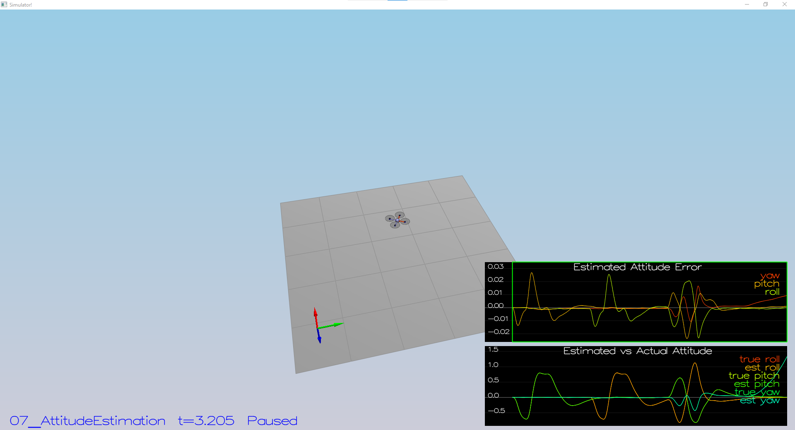
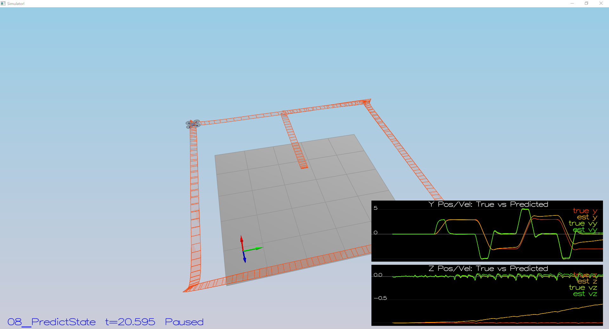
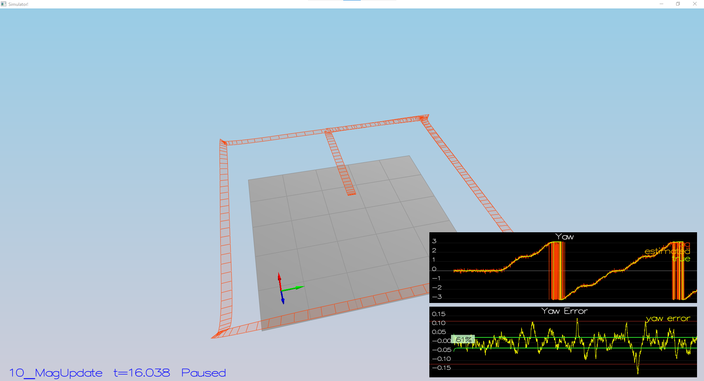
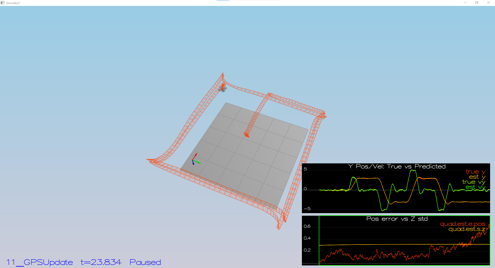
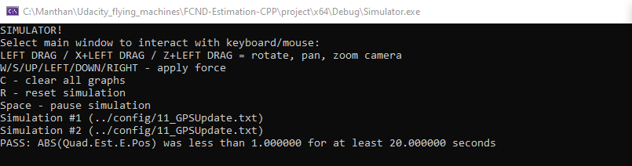

### Step 1: Sensor Noise ###

After running the simulation use an excel sheet to calculate the Mean and the standard deviation for the points given in the log files

***Success criteria:*** *Your standard deviations should accurately capture the value of approximately 68% of the respective measurements.*

NOTE: Your answer should match the settings in `SimulatedSensors.txt`, where you can also grab the simulated noise parameters for all the other sensors.

### Step 2: Attitude Estimation ###

1. Used the complementary filter technique to estimate the roll and pitch
2. Initialised a quaternion `qt` made out of the estimated roll, pitch and yaw
3. Integrated the euler angle to predicted state using the function *IntegrateBodyRate*.

### Step 3: Prediction Step ###

In this next step you will be implementing the prediction step of your filter.

1. Run scenario `08_PredictState`.  This scenario is configured to use a perfect IMU (only an IMU). Due to the sensitivity of double-integration to attitude errors, we've made the accelerometer update very insignificant (`QuadEstimatorEKF.attitudeTau = 100`).  The plots on this simulation show element of your estimated state and that of the true state.  At the moment you should see that your estimated state does not follow the true state.

2. Implementing `PredictState()` was simply finding the predicted mean which is a part of the extended Kalman Filter predict step as given in the lecture. The next step would be to predict the covariance using control parmeters.

4. `GetRbgPrime()` used information from the lecture and the estimated roll, pitch and yaw from complementary filter. In `predict()` function we calculated `g'` using the `Rbg'` matrix from the previous step and then set the estimated state and covariance with this new information. 

5. `QPosXYStd` = .03 and  `QVelXYStd` = .25 

### Step 4: Magnetometer Update ###

Up until now we've only used the accelerometer and gyro for our state estimation.  In this step, you will be adding the information from the magnetometer to improve your filter's performance in estimating the vehicle's heading.

1. Run scenario `10_MagUpdate`.  This scenario uses a realistic IMU, but the magnetometer update hasn’t been implemented yet. As a result, you will notice that the estimate yaw is drifting away from the real value (and the estimated standard deviation is also increasing).  Note that in this case the plot is showing you the estimated yaw error (`quad.est.e.yaw`), which is drifting away from zero as the simulation runs.  You should also see the estimated standard deviation of that state (white boundary) is also increasing.

2. Tune the parameter `QYawStd` = .09

3. Implement magnetometer update in the function `UpdateFromMag()`. `h'` is a row vector with last element as 1. Important thing to correct was the yaw from state vector. If it is greater than the magnometer yaw by **pi** or less by **-pi** then we need to add and subtract **2pi** respectively and  Once completed, you should see a resulting plot similar to this one:

### Step 5: Closed Loop + GPS Update ###

1. Implement the EKF GPS Update in the function `UpdateFromGPS()`. `h'` is a simple 6*7 matrix with diagonal elements as 1.

### Step 6: Adding Your Controller ###

Up to this point, we have been working with a controller that has been relaxed to work with an estimated state instead of a real state.  So now, you will see how well your controller performs and de-tune your controller accordingly.

1. Replace `QuadController.cpp` with the controller you wrote in the last project.

2. Replace `QuadControlParams.txt` with the control parameters you came up with in the last project.

3. Run scenario `11_GPSUpdate`. If your controller crashes immediately do not panic. Flying from an estimated state (even with ideal sensors) is very different from flying with ideal pose. You may need to de-tune your controller. Decrease the position and velocity gains (we’ve seen about 30% detuning being effective) to stabilize it.  Your goal is to once again complete the entire simulation cycle with an estimated position error of < 1m.

