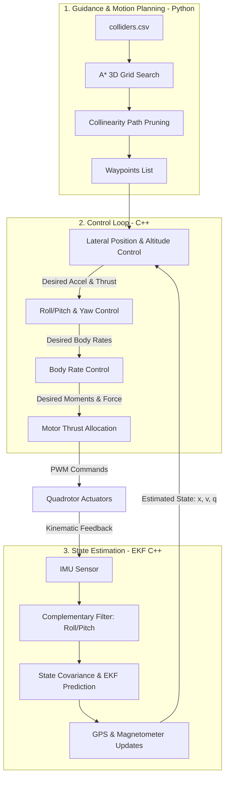
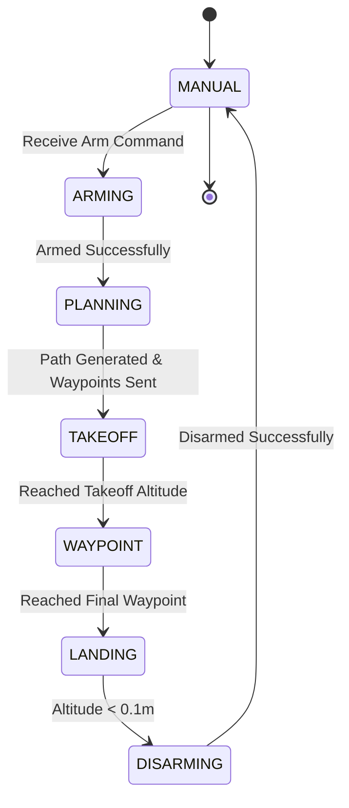
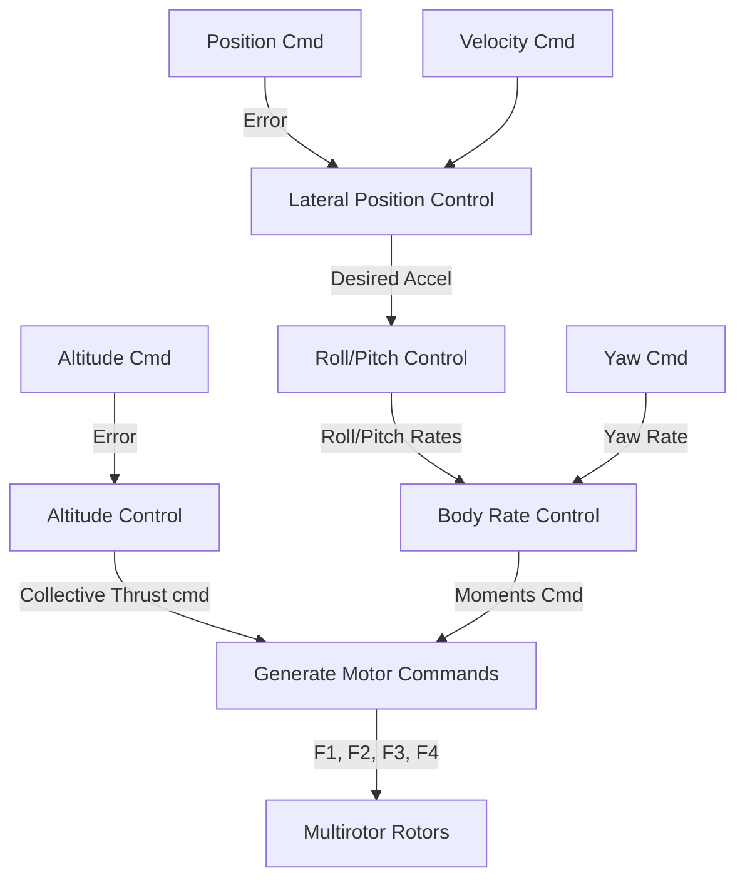

# Autonomous Flight Systems: Guidance, Navigation, and Control (GNC) Portfolio

This repository contains a comprehensive suite of autonomous flight projects developed for the **Udacity Flying Car Nanodegree**. The portfolio is divided into three key domains: **3D Autonomous Motion Planning** (in Python), **Cascaded PID Control** (in C++), and **Extended Kalman Filter (EKF) State Estimation** (in C++).

Together, these projects build a complete Guidance, Navigation, and Control (GNC) pipeline capable of flying a quadrotor autonomously through a dense urban simulator environment.

---

## Table of Contents
1. [System Architecture](#system-architecture)
2. [Project 1: 3D Autonomous Motion Planning](#project-1-3d-autonomous-motion-planning)
   - [State Machine Design](#state-machine-design)
   - [A* Search with 8-Way Connectivity](#a-search-with-8-way-connectivity)
   - [Collinearity-based Path Pruning](#collinearity-based-path-pruning)
3. [Project 2: Multirotor Cascaded PID Control](#project-2-multirotor-cascaded-pid-control)
   - [Cascade Control Loop Structure](#cascade-control-loop-structure)
   - [Implementation Breakdown](#implementation-breakdown)
   - [Gain Tuning Parameters](#gain-tuning-parameters)
4. [Project 3: Extended Kalman Filter (EKF) Estimation](#project-3-extended-kalman-filter-ekf-estimation)
   - [State and Process Models](#state-and-process-models)
   - [Prediction and Covariance Propagation](#prediction-and-covariance-propagation)
   - [Sensor Fusion Updates (GPS & Magnetometer)](#sensor-fusion-updates-gps--magnetometer)
5. [Installation & Simulation Setup](#installation--simulation-setup)

---

## System Architecture

The interaction between the three flight stack layers is structured as follows:



---

## Project 1: 3D Autonomous Motion Planning

### Overview
This project implements a path planning framework that computes a safe, collision-free trajectory for a quadrotor in a dense, simulated 3D city environment. The planning algorithm transitions geodetic coordinates (Latitude, Longitude, Altitude) to local NED coordinates, generates a 3D configuration space grid based on obstacle bounds from `colliders.csv`, executes a path search using A* with diagonal movement, and prunes redundant waypoints using collinearity checks.

### State Machine Design
The planning and flight execution are managed via a Finite State Machine (FSM) implemented in `motion_planning.py`. The FSM introduces a dedicated `PLANNING` state between `ARMING` and `TAKEOFF`:



### A* Search with 8-Way Connectivity
To generate smoother paths and shorten overall traversal distance, the standard 4-way search (North, South, East, West) was expanded to an **8-way connectivity grid** by adding diagonal movement. Diagonal steps are allocated a lateral traversal cost of $\sqrt{2} \approx 1.414$.

```python
# planning_utils.py - Action definition
class Action(Enum):
    WEST = (0, -1, 1)
    EAST = (0, 1, 1)
    NORTH = (-1, 0, 1)
    SOUTH = (1, 0, 1)
    SOUTH_EAST = (1, 1, sqrt(2))
    NORTH_EAST = (-1, 1, sqrt(2))
    SOUTH_WEST = (1, -1, sqrt(2))
    NORTH_WEST = (-1, -1, sqrt(2))
```

To ensure diagonal motions do not clip obstacle boundaries, the feasibility check `valid_actions()` enforces boundary checks and obstacle clearance for both cardinal and diagonal updates:

```python
# planning_utils.py - Action validation snippet
if (x + 1 > n or y + 1 > m) or grid[x + 1, y + 1] == 1:
    valid_actions.remove(Action.SOUTH_EAST)
if (x - 1 < 0 or y + 1 > m) or grid[x - 1, y + 1] == 1:
    valid_actions.remove(Action.NORTH_EAST)
```

### Collinearity-based Path Pruning
The raw paths produced by A* contain redundant, grid-locked points. To optimize path length and minimize abrupt control maneuvers, a **collinearity check** is applied to prune intermediate nodes lying along straight lines:

$$\det \begin{bmatrix} x_1 & y_1 & 1 \\ x_2 & y_2 & 1 \\ x_3 & y_3 & 1 \end{bmatrix} < \epsilon$$

```python
# planning_utils.py - Collinearity Pruning
def collinearity_check(p1, p2, p3, epsilon=1e-5):
    m = np.concatenate((p1, p2, p3), 0)
    det = np.linalg.det(m)
    return abs(det) < epsilon

def pruning(path, epsilon=1e-5):
    pruned_path = [p for p in path]
    i = 0
    while i < len(pruned_path) - 2:
        p1 = np.array([pruned_path[i][0], pruned_path[i][1], 1.]).reshape(1, -1)
        p2 = np.array([pruned_path[i+1][0], pruned_path[i+1][1], 1.]).reshape(1, -1)
        p3 = np.array([pruned_path[i+2][0], pruned_path[i+2][1], 1.]).reshape(1, -1)

        if collinearity_check(p1, p2, p3, epsilon):
            pruned_path.remove(pruned_path[i+1])
        else:
            i += 1
    return pruned_path
```

---

## Project 2: Multirotor Cascaded PID Control

### Overview
This project implements a multi-loop cascaded controller in C++ to stabilize and guide the quadrotor. It commands collective thrust and three rotational moments, translating these to individual rotor speeds to meet trajectory objectives under external disturbances.

### Cascade Control Loop Structure
The controller uses a cascaded architecture, running fast inner rate loops and outer tracking loops:



### Implementation Breakdown

1. **Motor Thrust Allocation (`GenerateMotorCommands()`)**:
   Converts desired collective thrust $F_t$ and moments $\tau_p, \tau_q, \tau_r$ into target motor thrusts $F_1, F_2, F_3, F_4$. The geometric allocation leverages the quadrotor's configuration (X-geometry):
   $$F_t = F_1 + F_2 + F_3 + F_4$$
   $$\tau_p = (F_1 - F_2 - F_3 + F_4) \frac{L}{\sqrt{2}}$$
   $$\tau_q = (F_1 + F_2 - F_3 - F_4) \frac{L}{\sqrt{2}}$$
   $$\tau_r = \kappa (-F_1 + F_2 - F_3 + F_4)$$

2. **Body Rate Control (`BodyRateControl()`)**:
   Proportional controller mapping error between target angular rates $pqr_{cmd}$ and actual rates $pqr$ to target control moments, scaled by the inertia tensor:
   $$\tau = I \cdot K_{pPQR} \cdot (pqr_{cmd} - pqr)$$

3. **Roll/Pitch Control (`RollPitchControl()`)**:
   Outer-loop attitude controller defining roll and pitch rates from target lateral accelerations. Translates commands through the rotation matrix $R_{I\to B}$:
   $$b^c = \frac{a_{cmd}}{-F_t / m}$$
   $$\dot{b}^c = K_{pBank} \cdot (b^c - b)$$
   $$\begin{bmatrix} p_{cmd} \\ q_{cmd} \end{bmatrix} = \frac{1}{R_{33}} \begin{bmatrix} R_{21} & -R_{11} \\ R_{22} & -R_{12} \end{bmatrix} \begin{bmatrix} \dot{b}^c_x \\ \dot{b}^c_y \end{bmatrix}$$

4. **Lateral Position Control (`LateralPositionControl()`)**:
   Tracks $XY$ position and velocity commands using proportional-derivative (PD) gains, generating target horizontal accelerations.

5. **Altitude Control (`AltitudeControl()`)**:
   Stabilizes vertical motion. Incorporates a feedforward acceleration term and an integral term to compensate for structural mass offsets (e.g., asymmetric cargo payload in Scenario 4):
   $$a_{z, cmd} = K_{pPosZ}(z_{cmd} - z) + K_{dPosZ}(\dot{z}_{cmd} - \dot{z}) + K_{iPosZ} \int (z_{cmd} - z)dt + a_{z, FF}$$
   $$F_{thrust} = m \cdot \frac{g - a_{z, cmd}}{R_{33}}$$

### Gain Tuning Parameters

The following parameters in `QuadControlParams.txt` were tuned to pass the tracking metrics of the simulator scenarios:

| Controller Gain | Description | Tuned Value |
|:---|:---|:---|
| `kpPosXY` | Lateral Position P-Gain | 3.0 |
| `kpPosZ` | Altitude Position P-Gain | 30.0 |
| `kpVelXY` | Lateral Velocity D-Gain | 10.0 |
| `kpVelZ` | Altitude Velocity D-Gain | 8.0 |
| `KiPosZ` | Altitude Position I-Gain | 40.0 |
| `kpBank` | Roll/Pitch Angle P-Gain | 14.0 |
| `kpYaw` | Heading Angle P-Gain | 3.0 |
| `kpPQR` | Body Rate P-Gain (Roll, Pitch, Yaw) | (50.0, 50.0, 30.0) |

---

## Project 3: Extended Kalman Filter (EKF) Estimation

### Overview
This project implements an Extended Kalman Filter (EKF) in C++ to fuse noisy sensor measurements (IMU, GPS, and Magnetometer) and generate a reliable state estimate for closed-loop control.

### State and Process Models
The EKF tracks a 7-dimensional state vector:
$$x = \begin{bmatrix} p_x & p_y & p_z & v_x & v_y & v_z & \psi \end{bmatrix}^T$$

- **State Propagation**:
  Position and velocity are integrated forward in time using acceleration rotated into the inertial frame ($R_{bg}$):
  $$g(x_t, u_t) = \begin{bmatrix} p_{t-1} + v_{t-1}\Delta t \\ v_{t-1} + (R_{bg} a_{body} - g)\Delta t \\ \psi_{t-1} \end{bmatrix}$$

### Prediction and Covariance Propagation
The prediction step propagates state uncertainty over time by updating the state covariance matrix $P$:
$$P_t = G_t P_{t-1} G_t^T + Q$$

where $G_t$ is the Jacobian matrix of the transition model evaluated at the current state, and $Q$ is the process noise covariance matrix. The Jacobian $G_t$ is constructed as:

$$G_t = \begin{bmatrix} 
I_{3\times3} & I_{3\times3}\Delta t & 0_{3\times1} \\ 
0_{3\times3} & I_{3\times3} & R_{bg}' a_{body}\Delta t \\ 
0_{1\times3} & 0_{1\times3} & 1 
\end{bmatrix}$$

`RbgPrime` ($R_{bg}'$) is the partial derivative of the rotation matrix with respect to yaw ($\psi$), derived as:

```cpp
// QuadEstimatorEKF.cpp - RbgPrime Calculation
RbgPrime(0, 0) = -cos(pitch) * sin(yaw);
RbgPrime(0, 1) = -sin(roll) * sin(pitch) * sin(yaw) - cos(roll) * cos(yaw);
RbgPrime(0, 2) = -cos(roll) * sin(pitch) * sin(yaw) + sin(roll) * cos(yaw);

RbgPrime(1, 0) = cos(pitch) * cos(yaw);
RbgPrime(1, 1) = sin(roll) * sin(pitch) * cos(yaw) - cos(roll) * sin(yaw);
RbgPrime(1, 2) = cos(roll) * sin(pitch) * cos(yaw) + sin(roll) * sin(yaw);

RbgPrime(2, 0) = 0; RbgPrime(2, 1) = 0; RbgPrime(2, 2) = 0;
```

### Sensor Fusion Updates (GPS & Magnetometer)

#### 1. GPS Update
GPS provides absolute position and velocity measurements in the 3D space:
$$z_{GPS} = \begin{bmatrix} p_x & p_y & p_z & v_x & v_y & v_z \end{bmatrix}^T$$

Since GPS directly measures the first six states of the EKF, the measurement Jacobian $H_{GPS}$ is a constant matrix:
$$H_{GPS} = \begin{bmatrix} I_{6\times6} & 0_{6\times1} \end{bmatrix}$$

#### 2. Magnetometer Update
The magnetometer measures yaw ($\psi$). To prevent mathematical anomalies at the boundary of heading measurements, the difference between the measured and estimated yaw must be wrapped within $[-\pi, \pi]$:

$$\Delta\psi = \text{WrapToPi}(z_{\psi} - \hat{\psi})$$

```cpp
// QuadEstimatorEKF.cpp - Yaw wrap check
VectorXf diff = z - zFromX;
if (diff(0) > F_PI) zFromX(0) += 2.f * F_PI;
if (diff(0) < -F_PI) zFromX(0) -= 2.f * F_PI;
```

#### 3. Closed-Loop Fusion Integration
Using a state estimator introduces latency and noise compared to an ideal ground-truth state. To maintain stability during EKF feedback control:
- Control gains in `QuadControlParams.txt` (position and velocity gains) were **de-tuned by approximately 30%** from the values in Project 2.
- De-tuning maintains stability under estimator latency, keeping absolute position error under **1 meter** in closed-loop flight.

---

## Installation & Simulation Setup

### Python (Project 1)
1. Install Python dependencies:
   ```bash
   pip install numpy matplotlib packaging udacidrone
   ```
2. Open the Udacity 3D Simulator.
3. Run the path planning script:
   ```bash
   python motion_planning.py --goal_lon -122.39292549 --goal_lat 37.7902035 --goal_alt -0.147
   ```

### C++ Controller & Estimator (Projects 2 & 3)
1. **Clone and Build**:
   ```bash
   mkdir build && cd build
   cmake ..
   make
   ```
2. **Execute Simulator**:
   Run the compiled executable to interface with the graphical simulator. Use the interface to toggle between:
   - **Scenario 2**: Roll/pitch and rate stabilization.
   - **Scenario 3**: 3D position and yaw waypoint tracking.
   - **Scenario 4**: Robustness check under center-of-mass offsets and variable masses.
   - **Scenario 5**: Continuous tracking of a complex figure-eight trajectory.
   - **Scenarios 6-11**: EKF predictions, magnetometer fusion, and GPS-driven closed-loop estimation.
